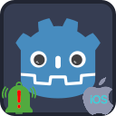

<p align="center">
  
</p>

---
#  Notification Scheduler Plugin
Notification Scheduler Plugin allows scheduling of local notifications on the iOS platform.

_For Android version, visit https://github.com/cengiz-pz/godot-android-notification-scheduler-plugin ._

##  Prerequisites
Follow instructions on the following page to prepare for iOS export:
- [Exporting for iOS](https://docs.godotengine.org/en/stable/tutorials/export/exporting_for_ios.html)

##  Installation
There are 2 ways to install the `Notification Scheduler` plugin into your project:
- Through the Godot Editor's AssetLib
- Manually by downloading archives from Github

###  Installing via AssetLib
Steps:
- search for and select the `iOS Notification Scheduler` plugin in Godot Editor
- click `Download` button
- on the installation dialog...
	- keep `Change Install Folder` setting pointing to your project's root directory
	- keep `Ignore asset root` checkbox checked
	- click `Install` button
- enable the addon via the `Plugins` tab of `Project->Project Settings...` menu, in the Godot Editor
- enable the plugin via the `iOS` section of `Project->Export...` menu, in the Godot Editor

###  Installing manually
Steps:
- download release archive from Github
- unzip the release archive
- copy to your Godot project's root directory
- enable the addon via the `Plugins` tab of `Project->Project Settings...` menu, in the Godot Editor
- enable the plugin via the `iOS` section of `Project->Export...` menu, in the Godot Editor

##  Notification icon
Select your notification icon via the `iOS` section of `Project->Export...` menu, in the Godot Editor

##  Usage
Add a `NotificationScheduler` node to your scene and follow the following steps:
- Call `NotificationScheduler` node's `initialize()` method and await `initialization_completed` signal before continuing to use other plugin methods.
- Register listeners for the following signals emitted from the `NotificationScheduler` node
	- `notification_opened` - when user taps notification item
	- `permission_granted`
	- `permission_denied`
- At startup, using the `NotificationScheduler` node to check that the application has permissions to post notifications:
```
	$NotificationScheduler.has_post_notifications_permission()
```
- If the application doesn't have permissions to post notifications, then request permission using the `NotificationScheduler` node:
```
	$NotificationScheduler.request_post_notifications_permission()
```
- `permission_granted` signal will be emitted when the application receives the permissions

- Create a notification channel using the `NotificationScheduler` node:
```
	$NotificationScheduler.create_notification_channel(
		NotificationChannel.new()
			.set_id("my_channel_id")
			.set_name("My Channel Name")
			.set_description("My channel description")
			.set_importance(NotificationChannel.Importance.DEFAULT))
```
- Build `NotificationData` object:
```
	var my_notification_data = NotificationData.new()
	my_notification_data.set_id(__notification_id).\
			set_channel_id("my_channel_id").\
			set_title("My Notification Title").\
			set_content("My notification content").\
			set_small_icon_name("ic_name_of_the_icon_that_you_generated").\
			set_delay(my_delay_in_seconds)
```
- In order to schedule repeating notifications, set the repeat interval value using `set_interval()``
	- Note: minimum interval value allowed on the iOS platform is 60 seconds.
- Schedule notification using the `NotificationScheduler` node:
```
	$NotificationScheduler.schedule(
			my_notification_data
		)
```
- _`NotificationData`'s `set_interval(interval_in_seconds)` method can be used for scheduling repeating notifications._
- _`NotificationData`'s `set_deeplink(data)` method can be used for delivering URI data along with the notification._
	- _The [Deeplink Plugin](https://github.com/cengiz-pz/godot-ios-deeplink-plugin) can then be used to process the URI data._

###  Other Available Methods
- `cancel(notification_id)` - cancel a notification before it is delivered.
- `set_badge_count()` - set the number that appears on the app icon. (Set to 0 to remove.)
- `get_notification_id()` - alternative way to get the ID of the last opened notification.
- `open_app_info_settings()` - open the notification settings screen for your app in iOS Settings app.

##  Troubleshooting

### XCode logs
XCode logs are one of the best tools for troubleshooting unexpected behavior. View XCode logs while running your game to troubleshoot any issues.


### Troubleshooting guide
Refer to Godot's [Troubleshooting Guide](https://docs.godotengine.org/en/stable/tutorials/export/exporting_for_ios.html#troubleshooting).

<br/><br/><br/>

---
#  Credits
Developed by [Cengiz](https://github.com/cengiz-pz)

Based on: [Godot iOS Plugin Template](https://github.com/cengiz-pz/godot-ios-plugin-template)

Original repository: [Godot iOS Notification Scheduler Plugin](https://github.com/cengiz-pz/godot-ios-notification-scheduler-plugin)

<br/><br/><br/>

___

#  Contribution

This section provides information on how to build the plugin for contributors.

<br/>

___

##  Prerequisites

- [Install SCons](https://scons.org/doc/production/HTML/scons-user/ch01s02.html)
- [Install CocoaPods](https://guides.cocoapods.org/using/getting-started.html)

<br/>

___

##  Build

- Run `./script/build.sh -A <godot version>` initially to run a full build
- Run `./script/build.sh -cgA <godot version>` to clean, redownload Godot, and rebuild
- Run `./script/build.sh -ca` to clean and build without redownloading Godot
- Run `./script/build.sh -cb -z4.0` to clean and build plugin without redownloading Godot and package in a zip archive as version 4.0
- Run `./script/build.sh -h` for more information on the build script

<br/>

___

##  Install Script

- Run `./script/install.sh -t <target directory> -z <path to zip file>` install plugin to a Godot project.
- Example `./script/install.sh -t demo -z bin/release/NotificationSchedulerPlugin-v4.0.zip` to install to demo app.

<br/>

___

##  Git addon submodule


###  Creating

- `git submodule add -b main --force --name addon https://github.com/cengiz-pz/godot-notification-scheduler-addon.git addon`


###  Updating

- Remove `addon` directory
- Run `git submodule update --remote --merge`

<br/>

___

##  Libraries

Library archives will be created in the `bin/release` directory.

<br/><br/><br/>

---
#  All Plugins

| Plugin | Android | iOS |
| :---: | :--- | :--- |
| Notification Scheduler | https://github.com/cengiz-pz/godot-android-notification-scheduler-plugin | https://github.com/cengiz-pz/godot-ios-notification-scheduler-plugin |
| Admob | https://github.com/cengiz-pz/godot-android-admob-plugin | https://github.com/cengiz-pz/godot-ios-admob-plugin |
| Deeplink | https://github.com/cengiz-pz/godot-android-deeplink-plugin | https://github.com/cengiz-pz/godot-ios-deeplink-plugin |
| Share | https://github.com/cengiz-pz/godot-android-share-plugin | https://github.com/cengiz-pz/godot-ios-share-plugin |
| In-App Review | https://github.com/cengiz-pz/godot-android-inapp-review-plugin | https://github.com/cengiz-pz/godot-ios-inapp-review-plugin |
